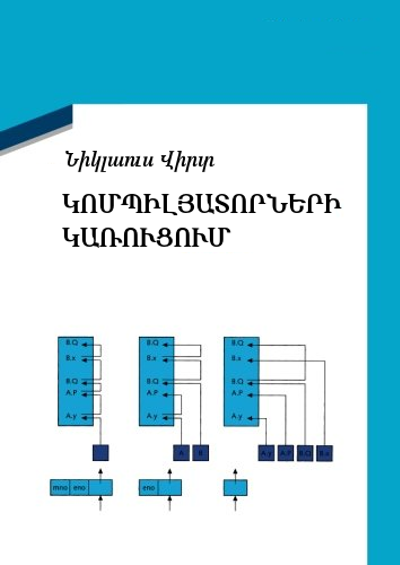

Կոմպիլյատորների կառուցում
=========================

Նիկլաուս Վիրտի «Կոմպիլյատորների կառուցում» գրքի սիրողական (և անօրինական) թարգմանություն։

1. [Ներածություն](chapter-01.md)
2. [Լեզու և շարահյուսություն](chapter-02.md)
3. [Կանոնավոր լեզուներ](chapter-03.md)
4. [Կոնտեքստից ազատ լեզուների վերլուծությունը](chapter-04.md)
5. [Ատրիբուտային քերականություններ և սեմանտիկաներ](chapter-05.md)
6. [Oberon-0 ծրագրավորման լեզուն](chapter-06.md)
7. [Oberon-0 լեզվի շարահյուսական վերլուծությունը](chapter-07.md)
8. [Հայտարարություններով որոշվող կոնտեքստ](chapter-08.md)
9. [RISC ճարտարապետպությունը որպես նպատակ](chapter-09.md)

