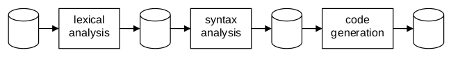

# Ներածություն

Կոմպյուտերային ծրագրերը գրվում են ծրագրավորման լեզվով և դրանցով որոշվում են հաշվողական պրոցեսների դասեր։ Սակայն կոմպյուտերները կատարում են ոչ թե ծրագրի տեքստը, այլ առանձին հրահանգների հաջորդականությունները։ Հետևաբար կոմպյուտերում կատարվելու համար ծրագրի տեքստը պետք է թարգմանվի համապատասխան հրահանգների հաջորդականության։ Այս թարգմանությունը կարելի է ավտոմատացնել, այսինքն՝ այն կարելի է ձևակերպել որպես ծրագիր։ Թարգմանող ծրագիրը կոչվում է *կոմպիլյատոր*, իսկ թարգմանվող տեքստը՝ *ելատեքստ* (երբեմն՝ source code)։

Դժվար չէ տեսնել, որ ելատեքստից հրահանգների հաջորդականության թարգմանության պրոցեսը որոշակի ջանքեր է պահանջում և ենթարկվում է բարդ կանոնների։ Մոտավորապես 1956 թվականին Fortran (formula translator) լեզվի առաջին կոմպիլյատորի ստեղծումը համարձակ քայլ էր, որի հաջողությունը շատ դեպքերում երաշխավորված չէր։ Այն պահանջեց մոտ 18 մարդ-տարի ջանք, և դրանով իսկ համարվեց իր ժամանակի ամենամեծ ծրագրային նախագծերից մեկը։

Թարգմանության խճճվածությունն ու բարդությունը կարելի է կրճատել միայն հստակ սահմանված և լավ ստրուկտուրավորված սկզբնական լեզվի ընտրությամբ։ Դա առաջին անգամ արվեց 1960 թվականին՝ Algol 60 լեզվի ի հայտ գալու հետ, որով դրվեցին կոմպիլյատորների նախագծման մինչ այժմ կիրառելի տեխնիկական հիմքերը։ Նաև առաջին անգամ ֆորմալ գրառման եղանակ օգտագործվեց լեզվի կառուցվածքը նկարագրելու համար (Naur, 1960)։

Թարգմանությունն այժմ ուղղորդվում է վերլուծվող տեքստի կառուցվածքով։ Տեքստը տրոհվում է, վերլուծվում է տրված *շարահյուսությանը* համապատասխան բաղադրիչների։ Շատ տարրական բաղադրիչների համար ճանաչվում է նրանց սեմանտիկան (իմաստը, նշանակությունը), իսկ բաղադրյալ մասերի նշանակությունը որոշվում է նրա բաղադրիչների սեմանտիկաներով։ Բնականաբար, թարգմանության ժամանակ պետք է պահպանվի սկզբնական տեքստի իմաստը։

Ըստ էության թարգմանության պրոցեսը կազմված է հետևյալ քայլերից.

1. Ծրագրային տեքստի նիշերի հաջորդականությունը թարգմանվում է լեզվի բառարանի *սիմվոլների* համապատասխան հաջորդականությանը։ Օրինակ, տառերից և թվանշաններից կազմված իդենտիֆիկատորները, թվանշաններից կազմված թվերը, հատուկ նիշերից կազմված բաժանիչներն ու գործողությունների նշանները (օպերատորներ) ճանաչվում են *լեքսիկական (նիշային) վերլուծություն* (lexical analysis) կոչվող փուլում։
2. Սիմվոլների հաջորդականությունը ձևափոխվում է սկզբնական տեքստի շարահյուսական կառուցվածքն արտացոլող ներկայացման, և հնարավորություն է տալիս հեշտությամբ ճանաչել այս կառուցվածքը։ Այս փուլը կոչվում է *շարահյուսական վերլուծություն*։
3. Բարձր մակարդակի լեզուները բնութագրվում են այն փաստով, որ ծրագրի օբյեկտները, օրինակ, փոփոխականներն ու ֆունկցիաները, դասակարգվում են ըստ իրենց տիպի։ Այդ պատճառով էլ, ի լրումն շարահյուսական կանոնների, լեզուն սահմանվում է նաև գործողությունների և նրանց արգումենտների համապատասխանության կանոններով։ Հետևաբար, կոմպիլյատորի լրացուցիչ խնդիրն է նաև այդ լրացուցիչ կանոնների ստուգումը։ Այս ստուգումը կոչվում է *տիպերի ստուգում*։
4. Երկրորդ քայլում կառուցված ներկայացման հիման վրա գեներացվում է նպատակային համակարգչի հրահանգների համակարգից վերցրած հրահանգների հաջորդականություն։ {?} Այս փուլը կոչվում է նպատակային *կոդի գեներացիա*։ Ընդհանրապես ասած, սա ամենաբարդ մասն է, հաճախ այն պատճառով, որ շատ համակարգիչների հրահանգների համակարգում պակասում է պահանջվող կանոնավորությունը։ Այդ պատճաթով էլ հաճախ կոդի գեներացիայի փուլը նորից բաժանվում է փուլերի։

Կոմպիլյացիայի պրոցեսի տրոհումը որքան հնարավոր է շատ մասերի 1980-ականներին գերակշռող տեխնիկա էր, քանի որ այդ ժամանակների մատչելի օպերատիվ հիշողությունը շատ փոքր էր՝ ամբողջ կոմպիլյատորը տեղավորելու համար։ Միայն կոմպիլյատորի առանձին մասերն էին տեղավորվում և դրանք կարող էին բեռնվել հաջորդաբար՝ մեկը մյուսի հետևից։ Այդ մասերը կոչվում էին *անցումներ*, իսկ ամբողջը կոչվում էր *բազմանցում կոմպիլյատոր*։ Անցումների քանակը սովորաբար 4-ից 6 էր, բայց հեղինակը ծանոթ է նաև 70 անցումներով կոմպիլյատորի (PL/I լեզվի համար)։ Սովորաբար `k`-րդ քայլի արդյունքը ծառայում էր `k+1`-րդ քայլի մուտք, իսկ սկավառակը կատարում էր միջանկյալ հիշողության դեր (Նկար 1.1)։ Սկավառակային հիշողությանը հաճախակի դիմելը հանգեցնում էր կոմպիլյացիայի մեծ ժամանակի։

Ժամանակակից համակարգիչները, իրենց գործնականորեն անսահմանափակ օպերատիվ հիշողությամբ, հնարավորություն են տալիս խուսափել սկաավառակային ժամանակավոր հիշողությունից։ Եվ դրա հետ միասին կարելի է խուսափել նաև սկավառակի վրա գրելիս տվյալների կառուցվածքների գծայնացման բարդ աշխատանքից և սկավառակից կարդալիս՝ դրանց վերականգնումից։ Հենց այդ պատճառով էլ հնարավոր է *մեկ անցումով կամպիլյատորներում* ժամանակը կրճատել մի քանի հարյուր անգամ։ Խիստ հաջորդական կարգով մեկը մյուսին կապվելու փոխարեն, տարբեր մասերը (խնդիրները) կարող են հաջորդել իրար։ Օրինակ, կոդի գեներացիան չի հետաձգվում մինչև բոլոր նախապատրաստական խնդիրներն ավարտվեն, այլ սկսվում է արդեն այն պահին, երբ ճանաչվում է սկզբնական տեքստի առաջին սենտենցիալ կառուցվածքը։

Խելամիտ լուծում է հանդիսանում front-end և back-end երկու մասերից բաղկացած կոմպիլյատորը։ Առաջինը ներառում է լեքսիկական վերլուծությունը, շարահյուսական վերլուծությունը և տիպերի ստուգումը, և գեներացնում է ծրագրի տեքստի շարահյուսական կառուցվածքը ներկայացնող ծառը։ Այս ծառը պահվում է հիմնական հիշողության մեջ և հանդիսանում է երկրորդ մասի մուտք, որը գեներացնում է նպատակային կոդը։ Այս լուծման գլխավոր առավելությունը front-end-ի անկախությունն է նպատակային մեքենայից և նրա հրահանգների բազմությունից։ Սա անգնահատելի առավելություն է, երբ պետք է տարբեր համակարգիչների համար մշակել նույն լեզվի կոմպիլյատոր, քանի որ նույն front-end-ը ծառայում է բոլորին։

Սկզբնական լեզվի և նպատակային ճարտարապետության առանձնացման գաղափարն է ընկած նաև այն նախագծերի հիմքում, որոնք տարբեր լեզուների համար ստեղծում են նույն back-end-ի համար ծառեր գեներացնող մի քանի front-end-եր։ Այն դեպքում, երբ `m` լեզուներն `n` համակարգիչների համար իրականացնելը պահանջում էր `m*n` կոմպիլյատորներ, այս դեպքում բավական են `m` front-end-երը և `n` back-end-երը (Նկար 1.2)։

Կոմպիլյատորների տեղափոխելիության խնդրի այս ժամանակակից լուծումը հիշեցնում է մեզ մի տեխնիկայի մասին, որը մոտավորապես 1975 թվականին նշանակալի դեր խաղաց Pascal լեզվի տարածման գործում (Wirth, 1971)։ Կառուցվածքային ծառի դերը կատարում էր վերացական համակարգչի հրամանների գծայնացված շարքը։ Back-end-ը հեշտությամբ իրականացված ինտերպրետացնող ծրագիր էր, իսկ հրահանգների գծային հաջորդականությունը կոչվում էր P-code։ Այս լուծման թերությունը արդյունավետության կորուստն էր, որ հատուկ է բոլոր ինտերպրետատորներին։

Հաճախ հանդիպում են կոմպիլյատորներ, որոնք ուղղակիորեն բինար կոդ գեներացնելու փոխարեն գեներացնում են ասեմբլեր լեզվի տեքստ։ Վերջնական թարգմանության համար կոմպիլյատորից հետո գործարկվում է նաև ասեմբլերը։ Հետևաբար անխուսափելի է երկար կոմպիլյացիայի ժամանակը։ Քանի որ այս եղանակը հազիվ թե որևէ առավելություն տա, մենք խորհուրդ չենք տալիս հետևել այս մոտեցմանը։

Ավելին, բարձր մակարդակի ծրագրավորման լեզուներն ավելի հաճախ են օգտագործվում ներդրված կիրառությունների միկրոկոնտրոլերների ծրագրավորման համար։ Այդպիսի համակարգերն ամենից առաջ օգտագործվում են տվյալների կուտակման և մեքենաների ավտոմատ կառավարման համար։ Այդ դեպքերում հիշողությունը սովորաբար փոքր է և չի կարող տեղավորել կոմպիլյատորը։ Դրա փոխարեն ծրագրային ապահովումը գեներացվում է այնպիսի համակարգչի վրա, որում հնարավոր է կոմպիլյացիան։ Կոմպիլյատորը, որը կոդ է գեներացնում այնպիսի համակարգչի համար, որը տարբեր է նրանից, որի վրա կատարվում է կոմպիլյացիան, կոչվում է cross-compiler։ Այնուհետև գեներացված կոդը փոխանցվում է, բեռնվում է, տվյալների փոխանակման գծով։

Հաջորդ գլուխներում կկենտրոնանաք կոմպիլյատորների կառուցման տեսական հիմունքներին, իսկ դրանից հետո՝ մեկ անցումով կոմպիլյատորի կառուցմանը։

 

