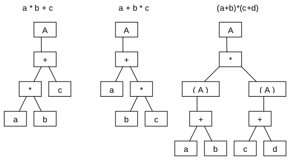
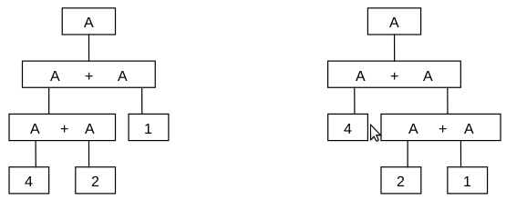

# Լեզու և շարահյուսություն

Ամեն մի լեզու բնորոշվում է իր կառուցվածքով, որը նրա քերականությունն է կամ շարահյուսությունը։ Օրինակ, ճիշտ կառուցված անգլերեն նախադասությունը (sentence) միշտ կազմված է ենթակայից (subject) ու ստորոգյալից (predicate)։ Ճիշտ ասելով այստեղ հասկանում ենք _ճիշտ կազմված_։ Այդ փաստը կարելի է նկարագրել հետևյալ բանաձևով․

````
sentence = subject predicate.
````

Եթե այս բանաձևին ավելացնենք երկու բանաձևեր ևս, որտեղ «`|`» նիշն արտասանվում է «կամ».

````
subject = "John" | "Mary".  
predicate = "eats" | "talks".  
````

ապա դրանով սահմանած կլինենք ճիշտ չորս նախադասություն.

````
John eats	Mary eats  
John talks	Mary talks  
````

Այս բանաձևերը կոչվում են _շարահյուսական կանոններ_, _արտածումներ_, կամ, ավելի պարզ, _շարահյուսական հավասարումներ_։ Ենթական ու ստորոգյալը շարահյուսական դասեր (classes) են։ Վերը բերված բանաձևերի համառոտ գրառումն անտեսում է իդենտիֆիկատորների իմաստը.

````
S = AB.                L = {ac, ad, bc, bd}  
A = "a" | "b".  
B = "c" | "d".  
````

Փոքր օրինակների համար այսուհետ կօգտագործենք գրառման այս կարճ ձևը։ `L` նախադասությունների բազմությունը, որ կարելի է ստանալ այս եղանակով, այն է՝ հավասարությունների ձախ կողմն աջ կողմով փոխարինելու կրկնվող քայլերով, կոչվում է _լեզու_։

Ակնհայտ է, որ վերը բերված օրինակը սահմանում է միայն չորս նախադասություններից կազմված լեզու։ Սովորաբար լեզուն բաղկացած է լինում անվերջ շատ նախադասություններից։ Հետևյալ օրինակը ցույց է տալիս, որ անվերջ բազմությունը հաջողությամբ կարող է սահմանվել վերջավոր թվով հավասարումերով։ ∅ նիշը ցուց է տալիս դատարկ բազմությունը։

````
S = A.                 L = {∅, a, aa, aaa, aaaa, ... }
A = "a" A | ∅.
````

Մեթոդը, որ հնարավորություն է տալիս անվերջ քանակով տեղադրումներ կատարել (այստեղ A-ն "a"A-ով), կոչվում է _ռեկուրսիա_։

Մեր երրորդ օրինակը նույնպես հիմնված է ռեկուրսիայի վրա։ Բայց այն գեներացնում է ոչ միայն կամայական թվով նույն սիմվոլներից կազմված նախադասություններ, այլ նաև ներդրված նախադասություններ.

````
S = A.                 L = {b, abc, aabcc, aaabccc, ... }
A = "a" A "c" | "b".
````

Պարզ է, որ այսպես կարելի է արտահայտել կամայական խորությամբ ներդրվածություններ (այս օրինակում A-երի), որ առավել կարևոր է ստրուկտուրավորված լեզուների սահմանման ժամանակ։

Մեր չորրորդ և վերջին օրինակը ցույց է տալիս մաթեմատիկական արտահայտությունների կառուցվածքը։ `E`, `T`, `F` և `V` սիմվոլները համապատասխանաբար նշանակում են expression (արտահայտություն), term (գումարելի), factor (արտադրիչ) և variable (փոփոխական)։

````
E = T | A "+" T.
T = F | T "*" F.
F = V | "(" E ")".
V = "a" | "b" | "c" | "d".
````

Այս օրինակով տեսանելի է, որ շարահյուսությունը ոչ միայն սահմանում է լեզվի նախադասությունների բազմությունը, այլը դրանք օժտում է ստրուկտուրայով։ Ինչպես ցույց է տրված 2.1 նկարում, շարահյուսությունը նախադասությունը տրոհում է բաղադրիչների։ Գրաֆիկական (պատկերային) ներկայացումները կոչվում են _կառուցվածքային_ (_ստրուկտուրային_) կամ _շարահյուսական ծառեր_։ 



Այժմ ավելի խիստ ձևակերպենք վերը բերված հասկացությունները.

Լեզուն սահմանվում է հետևյալ կերպ.

1. _Տերմինալային սիմվոլների_ բազմություն։ Այն սիմվոլներն են, որոնք հանդիպում են նախադասությունների մեջ։ Դրանք կոչվում են տերմինալային, որովհետև չեն կարող փոխարինվել այլ սիմվոլներով։ Տեղադրման գործողությունն ավարտվում է տերմինալային սիմվոլների վրա։ Մեր առաջին օրինակում այս բազմությունը բաղկացած է `a`, `b`, `c` and `d` տարրերից։ Տերմինալային սիմվոլների բազմությունը կոչվում է նաև _բառարան_։
2. _Ոչ տերմինալային սիմվոլների_ բազմություն։ Ներկայացնում են շարահյուսական դասերը և կարող են փոխարինվել։ Մեր առաջին օրինակում այս բազմությունը բաղկացած է `S`, `A` և `B` տարրերից։
3. _Շարահյուսական հավասարումների_ (արտածումների) բազմություն։ Սրանք սահմանում են ոչ տերմինալային սիմվոլների հնարավոր փոխարինումները։ Հավասարումներ գրվում են ամեն մի ոչ տերմինալային սիմվոլի համար։
4. _Սկզբնական սիմվոլ_։ Սա ոչ տերմինալային սիմվոլ է, որը վերը բերված օրինակներում նշված է `S` անունով։

Այսպիսով, լեզուն տեմինալային սիմվոլների հաջորդականությունների բազմություն է, որը, սկսելով սկզբնական սիմվոլից, կարող է գեներացվել շարահյուսական հավասարումների կրկնվող կիրառություններով, այսինքն՝ տեղադրումներով։

Ցանկալի է նաև խիստ և ճշգրիտ սահմանել շարահյուսական հավասարումների գրառման ձևը։ Թող որ ոչ տերմինալային սիմվոլները լինեն իդենտիֆիկատորներ այն տեսքով, ինչպես դրանք գիտենք ծրագրավորման լեզուներից, այն է՝ տառերի և թվանշանների հաջորդականություն, օրինակ, `expression` կամ `term`։ Թող տերմինալային սիմվոլները լինեն չակերտների մեջ վերցրած նիշերի հաջորդականություններ (տողեր), օրինակ, `"="`, `"|"`։ Այս հավասարումների կառուցվածքի սահմանման համար հարմար է օգտագործել հենց նոր սահմանված գործիքը.

````
syntax     = production syntax | ∅.
production = identifier "=" expression ".".
expression = term | expression "|" term.
term       = factor |  term factor.
factor     = identifier | string.
identifier = letter | identifier letter | identifier digit.
string     = stringhead """.
stringhead = """ | stringhead character.
letter     = "A" | ... | "Z".
digit      = "0" | ... | "9".
````

Գրառման այս եղանակը, համարյա նույն տեսքով, 1960 թ.-ին առաջարկվել է Ջ. Բեկուսի (J. Backus) և Պ. Նաուրի (P. Naur) կողմից՝ Algol 60 լեզվի շարահյուսության ֆորմալ նկարագրության համար։ Այդ պատճառով էլ այն կոչվում է Բեկուսի-Նաուրի գրառում (Backus Naur Form - BNF) [Naur, 1960]։ Ինչպես ցույց է տալիս մեր օրինակը, կրկնությունների համար ռեկուրսիայի օգտագործումը բավականին վնասում է գրվածի ընթեռնելիությանը։ Այդ պատճառով էլ ընդլայնում ենք այս գրառումը կրկնություն և ոչ-պարտադիրություն արտահայտող կառուցվածքներով։ Բացի այդ հնարավորություն ենք տալիս արտահայտությունները խմբավորել փակագծերով։ Այսպիսով, ներմուծվում է BNF-ի ընդլայնում EBNF-ը [Wirth, 1977], որն էլ անմիջապես օգտագործում ենք հենց իր ավելի ճշգրիտ սահմանման համար.

````
syntax     = {production}.
production = identifier "=" expression ".".
expression = term {"|" term}.
term       = factor {factor}.
factor     = identifier | string | "(" expression ")" 
           | "[" expression "]" | "{" expression "}".
identifier = letter {letter | digit}.
string     = """ {character} """.
letter     = "A" | ... | "Z".
digit      = "0" | ... | "9".
````

`{x}` տեսքի արտադրիչը համարժեք է `x`-երի անվերջ երկարությամբ հաջորդականության՝ ներառյալ դատարկ հաջորդականությունը։ Հետևյալ տեսքի արտածումը

````
A = AB | ∅.
````

այժմ ձևակերպված է ավելի համառոտ՝ `A = {B}`. `[x]` տեսքի արտադրիչը համարժեք է «`x` կամ ոչինչ» արտահայտությանը. այն արտահայտում է `x`-ի ոչ պարտադիր լինելը։  Հետևաբար դատարկ հաջորդականությունը ցույց տվող ∅ հատուկ նիշի անհրաժեշտությունը վերանում է։ 

Մաթեմատիկական ճշգրտությամբ լեզուների և դրանց քերականության սահմանման գաղափարը գալիս է Ն. Չոմսկուց (N. Chomsky)։ Պարզվել է, սակայն, որ տեղադրումների կանոնների այս պարզ սխեման բավարար չէ խոսակցական լեզուների բարդությունը ներկայացնելու համար։ Սա ճիշտ էր նաև այն դեպքում, երբ ֆորմալիզմն էապես ընդլայնվեց։ Սակայն, ի հակադրություն դրա, այս աշխատանքն անչափ արգասաբեր եղավ ծրագրավորման լեզուների տեսության և մաթեմատիկական ֆորմալիզմների համար։ Դրա շնորհիվ Algol 60-ը դարձավ առաջին ֆորմալ և ճշգրիտ սահմանված ծրագրավորման լեզուն։ Հընթացս նկատենք, որ այդ ճշգրտությունը վերաբերում էր շարահյուսությանը, բայց ոչ սեմանտիկային։

_Ծրագրավորման լեզու_ տերմինը նույնպես գալիս է Չոմսկու ֆորմալիզմից, քանի որ, պարզվում է, ծրագրավորման լեզուներն օժտված են խոսակցական լեզուներին հատուկ կառուցվածքով։ Կարծում ենք, որ այս տերմինն այնքան էլ հաջող չէ ընտրված, որովհետև ծրագրավորման լեզվով հնարավոր չէ խոսել, հետևաբար այն լեզու չէ՝ բառի իսկական իմաստով։ _Ֆորմալիզմ_-ը կամ _ֆորմալ գրառում_-ը կարող էին ավելի համապատասխան լինել։

Ոմանք զարմանում են, թե ինչո՛ւ է լեզվի նախադասությունների ճշգրիտ սահմանմանն այսքան մեծ կարևորություն տրվում։ Չէ որ իրականում դա այնքան էլ կարևոր չէ։ Սակայն կարևոր է իմանալ նախադասությունը ճի՛շտ է կազմված, թե ոչ։ Բայց նույնիսկ այստեղ կարելի է արդարացում գտնել։ Վերջ ի վերջո, (ճիշտ կազմված) նախադասության կառուցվածքը կարևոր է, որովհետև այն նախադասության իմաստը հասկանալու ճանապարհ է հանդիսանում։ Շարահյուսական կառուցվածքի շնորհիվ նախադասության առանձին մասերը և նրանց իմաստը կարող են ճանաչվել իրարից անկախ, իսկ իրար հետ նրանք կազմում են ամբողջի իմաստը։

Ասվածը պարզաբանենք գումարման գործողությունը պարունակող արտահայտությունների պարզ օրինակով։ Թող `E`-ն արտահայտություն է, իսկ `N`-ը թիվ.

````
E = N | E "+" E.
N = "1" | "2" | "3" | "4".
````

Ակնհայտ է, որ «`4 + 2 + 1`»-ը ճիշտ կազմված արտահայտություն է։ Այն կարելի է ստանալ մի քանի ճանապարհներով, որոնք, ինչպես ցույց է տրված 2.2 նկարում, ունեն տարբեր կառուցվածք։





Երկու տարբեր կառուցվածքները կարելի է արտահայտել փակագծերի օգնությամբ. համապատասխանաբար `(4 + 2) + 1` և `4 + (2 + 1)`։ Բարեբախտաբար, գումարման զուգորդականության շնորհիվ երկուսն էլ վերադարձնում են նույն `7` արժեքը։ Բայց դա միշտ այդպես չէ։ Եթե այս օրինակում գումարման փոխարեն օգտագործվի տարբերության գործողությունը, ապա երկու տարբեր կառուցվծաքները կտան երկու տարբեր արժեք. `(4 - 2) - 1 = 1`, `4 - (2 - 1) = 3`. Այս օրինակը ցուցադրում է հետևյալ երկու փաստերը.

1. Նախադասության մեկնաբանությունը միշտ հիմնվում է նրա շարահյուսական կառուցվածքի վրա։
2. Միարժեք լինելու համար ամեն մի նախադասություն պետք է ունենա միակ կառուցվածք։ 

Եթե երկրորդ պահանջը բավարարված չէ, ի հայտ են գալիս երկիմաստ նախադասություններ։ Դրանք կարող են հարստացնել խոսակցական լեզուները, սակայն երկիմաստ ծրագրավորման լեզուները պարզապես անպետք են։

Ասում ենք, թե շարահյուսական դասը երկիմաստ է, եթե նրան կարելի է համապատասխանեցնել մի քանի կառուցվածքներ։ Լեզուն երկիմաստ է, եթե այն պարունակում է գոնե մեկ երկիմաստ շարահյուսական դաս (կառուցվածք)։


2.1. Վարժություններ

2.1. «The Algol 60 Report» փաստաթուղթը պարունակում է հետևյալ շարահյուսությունը (թարգմանված է EBNF-ի):

````
primary  =  unsignedNumber | variable | "(" arithmeticExpression ")" | ... .
factor  =  primary | factor "" primary.
term  =  factor | term ("×" | "/" | "÷") factor.
simpleArithmeticExpression  =  term | ("+" | "-") term | simpleArithmeticExpression ("+" | "-") term.
arithmeticExpression  =  simpleArithmeticExpression |
	"IF" BooleanExpression "THEN" simpleArithmeticExpression "ELSE" arithmeticExpression.
relationalOperator  =  "=" | "" | "" | "<" | "" | ">" .
relation  =  arithmeticExpression relationalOperator arithmeticExpression.
BooleanPrimary  =  logicalValue | variable | relation | "(" BooleanExpression ")" | ... .
BooleanSecondary  =  BooleanPrimary | "¬" BooleanPrimary.
BooleanFactor  =  BooleanSecondary | BooleanFactor "" BooleanSecondary.
BooleanTerm  =  BooleanFactor | BooleanTerm "" BooleanFactor.
implication  =  BooleanTerm | implication "" BooleanTerm.
simpleBoolean  =  implication | simpleBoolean "" implication.
BooleanExpression  =  simpleBoolean |
	"IF" BooleanExpression "THEN" simpleBoolean "ELSE" BooleanExpression.
````

Կառուցել հետևյալ արտահայտությունների շարահյուսական ծառերը, որտեղ տառերը հանդիսանում են փոփոխականներ.

````
x + y + z
x × y + z
x + y × z
(x - y) × (x + y)
-x ÷ y
a + b < c + d
a + b < c  d  e  ¬ f  g > h  i × j = k  l  m - n + p  q
````


2.2. Հետևյալ արտածումները նույնպես Algol 60-ի սկզբնական սահմանման մասն են։ Դրանք պարունակում են անորոշություններ, որոնք հեռացվեցին վերանայված զեկույցում (Revised Report)։

````
forListElement  =  arithmeticExpression |
	arithmeticExpression "STEP" arithmeticExpression "UNTIL" arithmeticExpression |
	arithmeticExpression "WHILE" BooleanExpression.
forList  =  forListElement | forList "," forListElement.
forClause  =  "FOR" variable ":=" forList "DO" .
forStatement  =  forClause statement.
compoundTail  =  statement "END" | statement ";" compoundTail.
compoundStatement  =  "BEGIN" compoundTail.
unconditional Statement  =  basicStatement | forStatement | compoundStatement | ... .
ifStatement  =  "IF" BooleanExpression "THEN" unconditionalStatement.
conditionalStatement  =  ifStatement | ifStatement "ELSE" statement.
statement  =  unconditionalStatement | conditionalStatement.
````

Գտեք նվազագույնը երկու տարբեր կառուցվածքներ հետևյալ արտահայտությունների և հրամանների համար։ Թող որ A-ն և B-ն «պարզ հրամաններ» են։

````
IF a THEN b ELSE c = d
IF a THEN IF b THEN A ELSE B
IF a THEN FOR ... DO IF b THEN A ELSE B
````

Առաջարկեք այլընտրանքային շարահյուսություն, որը անորոշություններ չի պարունակում։


2.3. Ուսումնասիրել հետռյալ կառուցվածքները և նշել, թե որոնք են ճիշտ Algol-ում, և որոնք՝ Oberon-ում (տես Հավելված A.2).

````
a + b = c + d
a * -b
a < b & c < d
````

Հաշվել հետևյալ արտահայտությունները.

````
5 * 13 DIV 4  =
13  DIV  5*4  =
````


