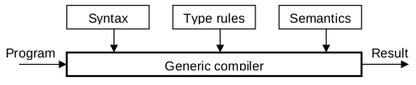

# Ատրիբուտներով քերականություններ և սեմանտիկաներ

Ատրիբուտներով քերականություններում առանձին կառուցվածքներին՝ ոչ տերմինալային սիմվոլներին, համադրված են որոշակի ատրիբուտներ։ Սիմվոլները պարամետրիզացված են և ներկայացնում են տարբերակների ամբողջ դասեր։ Սա թուլ է տալիս պարզեցնել շարահյուսությունը, իսկ գործնականում հնարավորություն է տալիս շարահյուսական անալիզատորը դարձնել իրական թարգմանիչ (Rechenberg and Mössenböck, 1985)։ Թարգմանության պրոցեսը բնորոշվում է ամեն մի ճանաչված սենտենցիալ կառուցվածքին մի որևէ արդյունքի (միգուցե դատարկ) համապատասխանեցմամբ։ Ամեն մի շարահյուսական հավասարումն ուղեկցվում է լրացուցիչ կանոններով, որոնք հարաբերություններ են սահմանում կրճատված սիմվոլների ատրիբուտային արժեքների, ստացված ոչ տերմինալային սիմվոլների ատրիբուտային արժեքների և արդյունքի միջև։ Ստորև առաջարկում ենք ատրիբուտների և ատրիբուտային կանոնների երեք կիրառություններ։


## Կանոններ տիպերի համար

Որպես պարզ օրինակ կդիտարկենք մի քանի տվյալների տիպ ունեցող մի լեզու։ Արտահայտությունների ամեն մի տիպի համար առանձին շարահյուսական կանոն նկարագրելու փոխարեն (ինչպես դա արված էր Algol-60 լեզվում), արտահայտությունները կսահմանենք ճիշտ մեկ անգամ, և նրանում մասնակցող կառուցվածքներին որպես ատրիբուտ կկցենք տվյանների `T` տիպը։ Օրինակ, `T` տիպի արտահայտությունը գրվում է `exp(T)`, այսինքն՝ `exp`-ը ունի `T` ատրիբուտը։ Ըստ այդմ՝ տիպերի համատեղելիության կանոնները դիտարկվում են որպես լրացումներ առանձին շարահյուսական կանոններին։ Օրինակ, այն պահանջը, որ գումարման և հանման գործողությունների երկու օպերանդներն էլ պետք է նույն տիպն ունենան, և արդյունքն էլ պետք է ունենա օպերանդների տիպը, տրված են այդիպիսի լրացուցիչ ատրիբուտային կանոններով.

````
Syntax                       Attribute rule  Context condition
exp(T0) =  term(T1)      |   T0 := T1
    exp(T1) "+" term(T2) |   T0 := T1        T1 = T2
    exp(T1) "-" term(T2).    T0 := T1        T1 = T2
````

Եթե `INTEGER` և `REAL` տիպերի օպերանդները պետք է թույլատրվեն խառն արտահայտություններում, ապա կանոններն ավելի մեղմ, բայց միևնույն ժամանակ ավելի բարդ են դառնում.

````
T0 := if (T1 = INTEGER) & (T2 = INTEGER) then INTEGER else REAL,

T1 = INTEGER  or  T1 = REAL
T2 = INTEGER  or  T2 = REAL
````

Ըստ էության, տիպերի համատեղելիության կանոնները նույնպես հաստատուն են այն իմաստով, որ դրանք կարող են ստուգվել առանց ծրագիրը կատարելու։ Այդ պատճառով էլ շարահյուսկան կանոններից դրանց առանձնացումը դառնում է անիմաստ, սակայն ատրիբուտային կանոնների տեսքով դրանց միավորումը շարահյուսության հետ լրիվ արդարացված է։ Սակայն նկատենք, որ ատրիբուտային քերականությունները նոր իմաստ են ստանում, երբ ատրիբուտի հնարավոր արժեքները (այստեղ՝ տիպերը) և նրանց քանակները նախապես հայտնի չեն։ 

Եթե շարահյուսական հավասարությունը կրկնության կառուցվածք է պարունակում, ապա, ատրիբուտային կանոնների տեսակետից, հարմար կլինի դա արտահայտել ռեկուրսիայի օգնությամբ։ Ոչ պարտադիրության կառուցվածքի առկայության դեպքում ավելի լավ է երկու դեպքերն արտահայտել իրարից առանձին։ Դա ցույց է տրված հետևյալ օրինակում. 

````
exp(T0) = term(T1) {"+" term(T2)}.   exp(T0) = ["-"] term(T1).
````

որտեղ արտահայտություններից ամեն մեկը տրոհված է կանոնների զույգի. 

````
exp(T0) =  term(T1) |                  exp(T0) =  term(T1) |
           exp(T1) "+" term(T2).              "-" term(T1).
````

Արտածման հետ համադրված տիպի կանոնները գործում են այն ժամանակ, երբ ճանաչվում է այդ արտածմանը համապատասխանող կառուցվածքը։ Այս համադրումը հեշտ է իրականացնել ռեկուրսիվ վայրէջքի եղանակով գրված վերլուծիչներում. ատրիբուտային կանոններն իրականացնող հրամանները պարզապես ներդրվում են վերլուծությունն իրականացնող հրամանների մեջ, իսկ ատրիբուտները ձևակերպվում են որպես շարահյուսական կառուցվածքների (ոչ տերմինալային սիմվոլների) վերլուծության համար գրված պրոցեդուրաների պարամետրեր։ Արտահայտությունները ճանաչող պրոցեդուրան կարող է առաջին օրինակ ծառայել այդ ընդլայնումը ցուցադրելու համար, որտեղ սկզբնական վերլուծող պրոցեդուրան ծառայում է որպես կմաղք.

````
PROCEDURE expression;
BEGIN term;
  WHILE (sym = "+") OR (sym = "-") DO
    GetSym; term
  END
END expression
````

Այս պրոցեդուրան ընդլայնվել է ատրիբուտային կանոններով.

````
PROCEDURE expression(VAR typ0: Type);
  VAR typ1, typ2: Type;
BEGIN term(typ1);
  WHILE (sym = "+") OR (sym = "-") DO
    GetSym; term(typ2);
    typ1 := ResType(typ1, typ2)
  END ;
  typ0 := typ1
END expression
````


## Կանոններ հաշվարկների համար

Որպես երկրորդ օրինակ դիտարկենք օպերանդներում միայն թվեր ունեցող արտահայտություններից կազմված լեզու։ Դա մի փոքր քայլ է, որը շարահյուսական անալիզատորը պարզապես վերլուծող ձրագրից ընդլայնում է միաժամանակ նաև արտահայտությունները հաշվարկող ծրագրի։ `val` ատրիբուտով ամեն մի կառուցվածքին համապատասխանեցնում ենք նրա արժեքը։ Մեր նախորդ օրինակի տիպերի համատեղելիության կանոնների նմանությամբ այժմ պետք է վերլուծության ընթացքում գործարկենք հաշվարկման կանոնները։ Այսպիսով, արդեն ներմուծել ենք սեմանտիկայի գրառման եղանակը․

````
Շարահյուսություն 			             Ատրիբուտային կանոն (սեմանտիկա)

exp(v0)	   = term(v1) |                  v0 := v1
             exp(v1) "+" term(v2) |	     v0 := v1 + v2
             exp(v1) "-" term(v2).       v0 := v1 - v2
term(v0)   = factor(v1) |	             v0 := v1
             term(v1) "*" factor(v2) |	 v0 := v1 * v2
             term(v1) "/" factor(v2).	 v0 := v1 / v2
factor(v0) = number(v1) |                v0 := v1
             "(" exp(v1) ")".            v0 := v1
````

Այստեղ ատրիբուտը ճանաչված կառուցվածքի հաշվարկված, թվային արժեքն է։ Համապատասխան վերլուծության պրոցեդուրայի անհրաժեշտ ընդլայնումով ստացվում է արտահայտությունների հաշվարկման հետևյալ պրոցեդուրան․

````
PROCEDURE expression(VAR val0: INTEGER);
  VAR val1, val2: INTEGER; op: CHAR;
BEGIN term(val1);
  WHILE (sym = "+") OR (sym = "-") DO
    op : = sym; GetSym; term(val2);
    IF op = "+" THEN val1 : = val1 + val2  ELSE val1 := val1 - val2 END
  END;
  val0 := val1
END expression
````


## Կանոններ թարգմանության համար

Ատրիբուտներով քերականությունների կիրառության երրորդ օրինակը բացահայտում է կոմպիլյատորի հիմնական գործունեություննը։ Արտածումների հետ համադրված լրացուցիչ կանոններն այստեղ ոչ թե ղեկավարում govern {?} են սիմվոլների ատրիբուտները, այլ ձևավորում են արտածվող կոդ, որը գործարկվում է վերլուծության ընթացքում արտածումը կիրառելիս։ Արտածվող տեքստի ձևավորումը կարող է դիտարկվել որպես վերլուծության կողմնակի էֆեկտ։ Սովորաբար այդ տեքստը հրամանների հաջորդականություն է։ Այս օրինակում հրամանները փոխարինված են վերացական սիմվոլներով, իսկ դրանց արտածումը կատարվում է `put` հրամանով։

````
Syntax                      Output rule (semantics)

exp    = term               -
       | exp "+" term       put("+")
       | exp "-" term.      put("-")
term   = factor	            -
       | term "*" factor    put("*")
       | term "/" factor.   put("/")
factor = number             put(number)
       | "(" exp ")".       -
````

Հեշտությամբ կարելի է ստուգել, որ վերլուծվող արտահայտության համար արտածված սիմվոլների հաջորդականությունը համապատասխանում է նրա ետածանցային (postfix) գրառմանը։ Այս դեպքում վերլուծիչը ընդլայնվել է որպես թարգմանիչ։

````
Infix notation      Postfix notation
2 + 3               2 3 +
2 * 3 + 4           2 3 * 4 +
2 + 3 * 4           2 3 4 * +
(5 - 4) * (3 + 2)   5 4 - 3 2 + *
````

Ստորև արտահայտությունները վերլուծող և թարգմանող պրոցեդուրան է։

````oberon
PROCEDURE expression;
  VAR op: CHAR;
BEGIN term;
  WHILE (sym = "+") OR (sym = "-") DO
    op := sym; GetSym; term; put(op)
  END
END expression
````

Աղյուղակով ղեկավարվող վերլուծիչ օգտագործելիս շարահյուսությունը ներկայացնող աղյուսակները հեշտությամբ կարող են ընդլայնվել ատրիբուտային կանոնները ներկայացնելու համար։ Եթե այդ աղյուսակները պարունակում են նաև հաշվարկման և թարգմանության կանոնները, ապա գայթակղություն է առաջանում խոսելու լեզվի ֆորմալ սահմանման մասին։ Աղյուսակով ղեկավարվող ունիվերսալ վերլուծիչը վերաճում է աղյուսակով֊ղեկավարվող ուիվերսալ կոմպիլյատորի։ Չնայած, որ այս գաղափարը ծագել է 1960֊ականներին, սակայն այն դեռ համարվում է ուտոպիա։ Նկար 5.1֊ում ունիվերսալ կոմպիլյատորի ուրվապատկերն է։


Նկար 5.1։ Ունիվերսալ, պարամետրիզացված կոմպիլյատորի սխեման։

Վերջին հաշվով, յուրաքանչյուր լեզվի հիմքում ընկած է շփման միջոց լինելու գաղափարը։ Սա նշանակում է, որ զրուցակիցները պետք է օգտագործեն և հասկանան միևնույն լեզուն։ Այս պատճառով էլ, լեզուն հեշտությամբ պարզեցնելու և ընդլայնելու գաղափարի զարգացումը {?} կարող է բացասական ազդեցություն թողնել։ Այնուամենայնիվ, հիմա սովորական է դարձել կոմպիլյատորները կառուցելիս օգտագործել աղյուսակով ղեկավարվող վերլուծիչներ, իսկ այդ աղյուսակները շարահյուսությունից ստանալ հատուկ գործիքների օգնությամբ։ Սեմանտիկան արտահայտվում է պրոցեդուրաներով, որոնց կանչերը նույնպես ավտոմատ ինտեգրվում են վերլուծիչում։ Դրանով իսկ կոմպիլյատորները դառնում են ոչ միայն շատ մեծ ու նվազ արդյունավետ, բայց նաև դառնում են պակաս թափանցիկ։ Այս վերջին պարագան մնում է մեր սկզբունքային հետաքրքրություններից մեկը, և այդ պատճառով էլ այսուհետ չենք հետևի այդ ուղղությանը։ {?}


## 5.4. Վարժություն

__5.1.__ Ընդլայնել EBNF տեքստի շարահյուսական վերլուծության ծրագիրն այնպես, որ այն գեներացնի (1) տերմինալային սիմվոլների ցուցակը, (2) ոչ֊տերմինալային սիմվոլների ցուցակը, և (3) ամեն մի ոչ֊տերմինալային սիմվոլի համար նրա _first_ և _follow_ բազմությունները։ Այնուհետև, այդ բազմություններն օգտագործելով, ծրագիրը պետք է պարզի, թե արդյոք տրված շարահյուսությունը վերլուծելի՞ է վերից֊վար ողանակով՝ մեկ սիմվոլ առաջ նայելով։ {?} Եթե վերլուծելի չէ, ապա ծրագիրը պետք է հարմար տեսքով դուրս բերի կոնֆլիկտային արտածումները։

Հուշում։ Օգտագործեք Ուորշելի (Warshall) ալգորիթմը (R. W. Floyd, Algorithm 96, Comm. ACM, June 1962)։

````oberon
TYPE matrix = ARRAY [1..n],[1..n] OF BOOLEAN;

PROCEDURE ancestor(VAR m: matrix; n: INTEGER);
(* Սկզբում m[i,j]֊ին վերագրվում է TRUE, եթե i֊ն j֊ի ծնողն է։
   Վերջում m[i,j]֊ն TRUE է, եթե i֊ն նախորդում է j֊ին *)
  VAR i, j, k: INTEGER;
BEGIN
  FOR i := 1 TO n DO
    FOR j := 1 TO n DO
      IF m[j, i] THEN
        FOR k := 1 TO n DO
          IF m[i, k] THEN m[j, k] := TRUE END
        END
      END
    END
  END
END ancestor
````

Կարելի է ընդունել, որ վերլուծվող լեզվի տերմինալային և ոչ֊տերմինալային սիմվոլների քանակը չի գերազանցում տրված առավելագույն թիվը (օրինակ, 32)։


