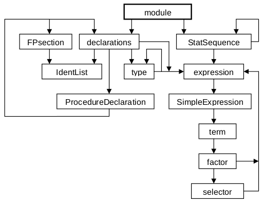

# Oberon-0 լեզվի շարահյուսական վերլուծությունը

## Բառային վերլուծություն

Մինչ շարահյուսական վերլուծիչի մշակումը սկսելը ուշադրություն դարձնենք նրա բառային վերլուծիչին։ Այն պետք է սկզբնային տեքստում ճանաչի տերմինալային սիմվոլները։ Նախ՝ թվարկենք լեզվի բառարանը (բառապաշարը)։

````
* DIV MOD & + - OR
= # < <= > >= . , : ) ]
OF THEN DO UNTIL ( [ ~ := ;
END ELSE ELSIF IF WHILE REPEAT
ARRAY RECORD CONST TYPE VAR PROCEDURE BEGIN MODULE
````

Մեծատառերով գրված բառերը ինքնուրույն միավորներ են՝ տերմինալային սիմվոլներ, դրանք կոչվում են _պահեստավորված բառեր_։ Դրանք պետք է ճանաչվեն բառային վերլուծիչի կողմից և չեն կարող օգտագործվել որպես իդենտիֆիկատորներ։ Ի լրումն թվարկված սիմվոլների, իդենտիֆիկատորներն ու թվերը նույնպես համարվում են տերմինալային սիմվոլներ։ Այսինքն՝ բառային վերլուծիչը պատասխանատու է նաև իդենտիֆիկատորները և թվերը ճանաչելու համար։

Նպատակահարմար է բառային վերլուծիչը սահմանել որպես առանձին մոդուլ։ Իսկապես, բառային վերլուծիչները մոդուլի գաղափարի օգտագործման դասական օրինակներ են։ Մոդուլը հնարավորություն է տալիս օգտագործողից՝ շարահյուսական վերլուծիչից, թաքցնել իրականացման մանրամասները և տեսանելի դարձնել (դուրս հանել, to export) միայն այն հատկությունները, որոնք պետք են օգտագործողին։ Օգտագործողին տեսանելի հատկությունները ձևավորում են մոդուլի ինտերֆեյսը։

````oberon
DEFINITION OSS; (*Oberon Subset Scanner*)
  IMPORT Texts;
    CONST IdLen = 16;
      (*symbols*) null = 0; times = 1; div = 3; mod = 4;
      and = 5; plus = 6; minus = 7; or = 8; eql = 9;
      neq = 10; lss = 11; leq = 12; gtr = 13; geq = 14;
      period = 18; int = 21; false = 23; true = 24;
      not = 27; lparen = 28; lbrak = 29;
      ident = 31; if = 32; while = 34;
      repeat = 35;
      comma = 40; colon = 41; becomes = 42; rparen = 44;
      rbrak = 45; then = 47; of = 48; do = 49;
      semicolon = 52; end = 53;
      else = 55; elsif = 56; until = 57;
      array = 60; record = 61; const = 63; type = 64;
      var = 65; procedure = 66; begin = 67; module = 69;
      eof = 70;

  TYPE Ident = ARRAY IdLen OF CHAR;

  VAR val: INTEGER;
    id: Ident;
    error: BOOLEAN;

  PROCEDURE Mark(msg: ARRAY OF CHAR);
  PROCEDURE Get(VAR sym: INTEGER);
  PROCEDURE Init(T: Texts.Text; pos: LONGINT);
END OSS.
````

Սիմվոլներն արտապատկերվում են ամբողջ թվերի։ Արտապատկերումը կազմակերպված է հաստատունների բազմություն սահմանելով։ `Mark` պրոցեդուրան ծառայում է ծրագրի տեքստում հայտնաբերված սխալների մասին հաղորդագրություններ արտածելու համար։ Սովորաբար հայտնաբերված սխալի և նրա դիրքի մասին կարճ հաղորդագրություն է գրանցվում {?}֊ում։ `Get` պրոցեդուրան բուն բառային վերլուծիչն է։ Ամեն մի կանչի ժամանակ այն վերադարձնում է հերթական ճանաչած սիմվոլը։ Այդ պրոցեդուրան կատարում է հետևյալ գործողությունները․

1. Բացատներն ու տողի վերջի նիշերն անտեսվում են։
2. Ճանաչվում են ծառայողական բառերը, ինչպիսիք են `BEGIN`֊ը և `END`֊ը։
3. Տառերի ու թվերի հաջորդականությունները՝ տառով սկսվող, որոնք ծառայողական բառեր չեն, ճանաչվում են որպես իդենտիֆիկատորներ։ `sym` պարամետրին տրվում է `ident` արժեքը, իսկ կարդացած նիշերի հաջորդականությունը վերագրվում է `id` գլոբալ փոփոխականին։
4. Թվանշանների հաջորդականությունները ճանաչվում են որպես թվեր։ `sym` պարամետրին տրվում է `number` արժեքը, իսկ կարդացած թիվը վերագրվում է `val` գլոբալ փոփոխականին։
5. Հատուկ նիշերի միակցությունները, ինչպիսիք են, օրինակ, `:=` և `<=`, ճանաչվում են որպես սիմվոլներ։
6. Մեկնաբանությունները, որոնք կամայական միշեր են՝ սկսվող `(*` և ավարտվող `*)` սիմվոլներով, անտեսվում են։
7. Եթե կարդացվել է անթույլատրելի նիշ (ինչպիսիք են, օրինակ, `$` և `%`), ապա վերադարձվում է `null` սիմվոլը։ Եթե կարդալու պրոցեսը հասել է տեքստի վերջին, ապա վերադարձվում է `eof` սիմվոլը։ Այս սիմվոլներից և ոչ մեկը չի հանդիպում ծրագրերի ճիշտ գրված տեքստերում։


## Շարահյուսական վերլուծություն

Շարահյուսական վերլուծիչի կառուցվածքը ճշտորեն հետևում է 3֊րդ և 4֊րդ գլուխներում բացատրված կանոններին։ Սակայն, մինչև նր կառուցմանն անցնելը, անհրաժեշտ է ստուգել համապատասխանո՞ւմ է արդյոք շարահյուսությունն այն սահմանափակումներին, որոնք երաշխավորում են մեկ սիմվոլ առաջ նայելով դետերմինացված վերլուծությունը։ Այս նպատակով նախ կառուցենք `first` և `follow` բազմությունները։ Դրանք ներկայացված են հետևյալ աղյուսակներում։

 __S__                   | __First(S)__
:-------------------:|:-----------:
selector             | . [ *
factor               | ( ~ integer ident
term                 | ( ~ integer ident
SimpleExpression     | + - ( ~ integer ident
expression           | + - ( ~ integer ident
assignment           | ident
ProcedureCall        | ident
statement            | ident IF WHILE REPEAT *
StatementSequence    | ident IF WHILE REPEAT *
FieldList            | ident *
type                 | ident ARRAY RECORD
FPSection            | ident VAR
FormalParameters     | (
ProcedureHeading     | PROCEDURE
ProcedureBody        | END CONST TYPE VAR PROCEDURE BEGIN
ProcedureDeclaration | PROCEDURE
declarations         | CONST TYPE VAR PROCEDURE *
module               | MODULE


__S__  | __Follow(S)__
-------------|------------------
selector | * DIV MOD & + - OR = # < <= > >= , ) ] := OF THEN DO ; END ELSE ELSIF UNTIL
factor   | * DIV MOD & + - OR = # < <= > >= , ) ] OF THEN DO ; END ELSE ELSIF UNTIL
term     | + - OR = # < <= > >= , ) ] OF THEN DO ; END ELSE ELSIF UNTIL
SimpleExpression | = # < <= > >= , ) ] OF THEN DO ; END ELSE ELSIF UNTIL
expression | , ) ] OF THEN DO ; END ELSE ELSIF UNTIL
assignment | ; END ELSE ELSIF UNTIL
ProcedureCall | ; END ELSE ELSIF UNTIL
statement | ; END ELSE ELSIF UNTIL
StatememtSequence | END ELSE ELSIF UNTIL
FielsList | ; END
type | ) ;
FPSection | ) ;
FormalParameters | ;
ProcedureHeading | ;
ProcedureBody | ;
ProcedureDeclaration | ;
declarations | END BEGIN

Դետերմինացվածության կանոնների հետագա ստուգումները ցույց են տալիս, որ Oberon-0֊ի այս շարահյուսությունը իսկապես կարող է վերլուծվել ռեկուրսիվ վայրէջքի եղանակով՝ առաջ նայելով մեկ սիմվոլ։ Ամեն մի ոչ֊տերմինալային սիմվոլին համապատասխան նախատեսված է մի պրոցեդուրա։ Բայց, մինչև պրոցեդուրաների սահմանումը, օգտակար է ուսումնասիրել, թե ինչպես են դրանք կախված միմյանցից։ Այս նպատակի համար պատրաստենք կախվածության գրաֆը (նկ․ 7.1)։ Յուրաքանչյուր պրոցեդուրա ներկայացված է որպես հանգույց, և մեկական կող է տարված բոլոր այն հանգույցներին, որին կպված է տվյալ պրոցեդուրան, այսինքն՝ ունի ուղղակի կամ անուղղակի կանչ։ {??} Նկատենք, որ ոչ֊տերմինալային սիմվոլներից որոշներն այս գրաֆում ներկայացված չեն, քանի որ դրանք ակնհայտորեն ներառված են այլ սիմվոլներում։ {??} Օրինակ, `ArrayType` և `RecordType` սիմվոլները կախված են միայն `type` սիմվոլից, և այդ պատճառով էլ բացահայտ պատկերված չեն։ Բացի այդ հիշում ենք, որ `ident` և `integer` սիմվոլները հանդիսանում են տերմինալային սիմվոլներ, որովհետև այդպես են մեկնաբանված բառային վերլուծիչի կողմից։



Նկար 7.1։ Շարահյուսական վերլուծիչի պրոցեդուրաների կախվածության գրաֆը։

Գծապատկերի ամեն մի ցիկլը համապատասխանում է մի ռեկուրսիայի։ Ակնհայտ է, որ շարահյուսական վերլուծիչը պետք է իրականացվի ռեկուրսիվ պրոցեդուրաներ թույլատրող ծրագրավորման լեզվով։ Ավելին, գծապատկերը բացահայտում է նաև, թե ինչպես կարող են պրոցեդուրաները ներդրվել։ Միակ պրողեդուրան, որն այլ պրոցեդուրաների չի կանչվում, `Module`֊ն է։ Այս գծապատկերն արտացոլում է ծրագրի կառուցվածքը։ Շարահյուսական վերլուծիչը, ինչպես և բառային վերլուծիչը, ձևակերպված է որպես առանձին մոդուլ։


## Շարահյուսական սխալների մշակումը

Մինչ այժմ դիտարկվում էր սկզբնային տեքստի՝ նրա հիմքում ընկած շարահյուսությանը համապատասխանելու բավականաչափ պարզ խնդիրը։ Որպես կողմնակի էֆեկտ, շարահյուսական վերլուծիչը ճանաչում է նաև կարդացվող տեքստի կառուցվածքը։ Հենց որ անթույլատրելի սիմվոլ է հանդիպում, շարահյուսական վերլուծիչի գործն ավարտվում է, և վերլուծության ընթացքն ընդհատվում է։ Գործնական կիրառություններուն, սակայն, այս մոտեցումն անընդունելի է։ Իսկական {?} կոմպիլյատորը պետք է հաղորդագրություն տա սխալի մասին և շարունակի վերլուծությունը։ Հնարավոր է, որ այնուհետև ուրիշ սխալներ լ բացահայտվեն։ Սխալի բացահայտումից հետք վերլուծության շարունակությունը, այնուամենայնիվ, հնարավոր է միայն սխալի բնույթի մասին որոշակի նախադրյալների {?} առկայության դեպքում։ {??} Այդ նախադրյալներից {?} կախված, վերլուծվող տեքստի որոշակի հատվածը կամ պետք է բաց թողնել, կամ նրանում որոշ սիմվոլներ {?} (նիշեր)։ Այդպիսի քայլերն անհրաժեշտ են նույնիսկ այն դեպքում, երբ սխալ պարունակող ծրագրի ուղղումը կամ կատարումը բոլորովին անհույս է {?}։ Առանց ճշգրիտ, թեկուզև մասնակի, նախադրյալներ {?} ունենալու՝ վերլուծությունը շարունակելը անօգուտ է (Graham and Rhodes, 1975; Rechenberg and Mössenböck, 1985)։ {??}

Լավ հիպոթեզների ընտրության մեթոդները բարդ են։ Վերջ ի վերջո դրանք հանգում են էվրիստիկ մեթոդների, քանի որ խնդիրը դեռևս ձևայնացված չէ։ Սրա սկզբունքային պատճառն այն է, որ ֆորմալ շարահյուսությունն անտեսում է այն գործոնները, որոնք նախադասությունը ճանաչելիս հեշտ են ընկալվում մարդու կողմից։ {??} Օրինակ, կետադրական նշանի բաց թողնելը հաճախ հանդիպող սխալ է՝ և ոչ միայն ծրագրի տեքստում, իսկ թվաբանական արտահայտություններում գործողության նշանը հազվադեպ  բաց թողնվում։ Շարահյուսական վերլուծիչի համար այդ երկու նիշերը իրարից բնույթով չտերբերվող շարահյուսական սիմվոլներ են, սակայն ծրագրավորողի համար կետ֊ստորակետը նիշը համարյա ավելորդ է, իսկ գումարման նիշը արտահայտության իմաստն է։ {??} Այսպիսի տարբերությունները պետք է հաշվի առնել, եթե սխալները պետք է մշակվեն ըստ իրենց իմաստի։ Ընդհանրացնելու համար ձևակերպենք սխալների մշակման հետևյալ որակական պահանջները․

1. Տեքստի մեկ անցումով պետք է բացահայտել հնարավորիս շատ սխալներ։
2. Որքան հնարավոր է քիչ լրացուցիչ ենթադրություններ պետք է արվեն լեզվի բնույթի մասին։
3. Սխալների մշակման միջոցները չպետք է դանդաղեցնեն շարահյուսական վերլուծիչի աշխատանքը։
4. Շարահյուսական վերլուծության ծրագիրը չպետք է չափերով մեծանա։

Կաարող ենք ենթադրել, որ սխալի մշակումը խիստ կախված է կոնկրետ դեպքից, և ըհդհանուր կանոնով այն կարող է սահմանվել միայն մասնակի հաջողությամբ։ Այնուամենայնիվ, կան մի քանի էվրիստիկ կանոններ, որոնք, թվում է, օգտակար կլինեն նաև մեր լեզվի՝ Օբերոնի շրջանակներից դուրս։ {??} Հիմնականում դրանք լեզվի նախագծման վրա ազդում են այնքան, ինչքան և ազդում են սխալների մշակման մեթոդի վրա։ {??} Անկասկած, լեզվի պարզ կառուցվածքը էապես պարզեցնում է սխալների հայտնաբերումը, կամ, այլ բառերով ասած, բարդ շարահյուսությունը անպայմանորեն բարդեցնում է նաև սխալների մշակումը։

Եկեք տարբերենք սխալ ծրագրերի երկու դեպք։ Առաջինն այն է, երբ տեքստում բացակայում են անհրաժեշտ նիշերը։ Այս դեպքը համեմատաբար հեշտ է մշակել։ Շարահյուսական վերլուծիչը, հայտնաբերելով սխալը, շարունակում է իրա աշխատանքը՝ բառային վերլուծիչի մեկ կամ մի քանի հաջորդական կանչերով։ Որպես օրինակ կարող է ծառայել հրամանը, որոտեղ արտահայտության վերջում սպասվում է փակող կլոր փակագիծ։ Եթե այն բաց է թողնված, վերլուծությունը շարունակվում է սխալի մասին հաղորդագրություն արտածելուց հետո․

````oberon
IF sym = rparen THEN Get(sym) ELSE Mark(" ) missing") END
````

Ընդահնրապես, միայն թույլ սիմվոլները կարող են բաց թողնվել, սիմվոլները, որոնք ունեն բացառապես շարահյուսական բնույթ, այդպիսիք են ստորակետը, կետ֊ստորակետը և ավարտող (եզրափակող) սիմվոլները։ {??} Դեպքը, երբ վերագրման գործողության փոխարեն օգտագործվել է հավասարության նշանը, նույնպես հեշտ է մշակվում։

Երկրորդն այն դեպքն է, երբ տեքստում առկա են անթույլատրելի (սխալ) սիմվոլներ։ Այստեղ այլ բան չի մնում, քան բաց թողնել դրանք, և վերլուծությունը շարունակել հաջորդ սիմվոլներից։ Սխալի հայտնաբերումից հետո վերլուծության վերականգնումն ապահովելու համար Օբերոնը համալրված է այնպիսի կառուցվածքներով, որոնք սկսվում են բնութագրող սիմվոլներով, և այդ սիմվոլները, իրենց բնույթից ելնելով, հազվադեպ են սխալ օգտագործվում։ {??} Օրինակ, հայտարարման հաջորդականությունը սովորաբար սկսվում է `CONST`, `TYPE`, `VAR` կամ `PROCEDURE` սիմվոլներով, իսկ ղեկավարող կառուցվածքները միշտ սկսվում են `IF`, `WHILE`, `REPEAT`, `CASE` և այլն։ Այդ պատճառով էլ ասյպիսի ուժեղ սիմվոլները երբեք բաց չեն թողնվում։ Դրանք տեքստում ծառայում են որպես սինխրոնիզացիայի կետեր, որոնցից վերլուծության պրոցեսը կարող է շարունակվել մեծ հավանականությամբ։ Օբերոնի շարահյուսության մեջ սահմանենք սինխրոնիզացիայի չորս կետեր․ `factor`, `statement`, `declarations` և `type`։ Համապատասխան վերլուծության պրոցեդուրայի սկզբում բաց են թողնվում ոչ պետքական սիմվոլները։ Վերլուծության պրոցեսը շարունակվում է, երբ ընթերցվում է ճիշտ սկզբնական կամ ուժեղ սիմվոլ։

````oberon
PROCEDURE factor;
BEGIN (*sync*)
  IF sym < lparen THEN Mark("ident?");
    REPEAT Get(sym) UNTIL sym >= lparen
  END;
  ...
END factor;

PROCEDURE StatSequence;
BEGIN (*sync*)
  IF sym < ident THEN Mark("Statement?");
    REPEAT Get(sym) UNTIL sym >= ident
  END;
  ...
END StatSequence;

PROCEDURE Type;
BEGIN (*sync*)
  IF (sym # ident) & (sym >= const) THEN Mark("type?");
    REPEAT Get(sym) UNTIL (sym = ident) OR (sym >= array)
  END;
  ...
END Type;

PROCEDURE declarations;
BEGIN (*sync*)
  IF sym < const THEN Mark("declaration?");
    REPEAT Get(sym) UNTIL sym >= const
  END;
  ...
END declarations;
````


