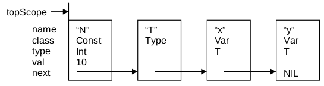

# Հայտարարություններով որոշվող կոնտեքստ {?}

## Հայտարարություններ

Թեև ծրագրավորման լեզուներն ունեն Չոմսկու իմաստով կոնտեքսից ազատ քերականություններ, բայց դրանք կոնտեքստից ազատ չեն այդ երևույթի սովորական իմաստով։ Կոնտեքստից կախվածությունն արտահայտվում է այն փաստով, որ ծրագրի բոլոր իդենտիֆիկատորները պետք է հայտարարված լինեն։ Դրանով այն համապատասխանեցված է հաշվարկման պրոցեսի օբյեկտի հետ, որն օժտված է որոշակի չփոփոխվող հատկանիշներով։ Օրինակ, իդենտիֆիկատորը համապատասխանեցված է փոփոխականի, իսկ այդ փոփոխականն էլ ունի իդենտֆիկատորի հայտարաման ժամանակ որոշված տվյալների տիպը։ {??} Հրամանի մեջ հանդիպող իդենտիֆկատորը հղվում է իր հայտարարման ժամանակ տրված օբյեկտին, և այդ հայտարարությունն էլ գտնվում է հրամանի սահմաններից դուրս։ Ասում ենք, որ հայտարարությունը գտնվում է հրամանի կոնտեքստում։ {??}

Ակնհայտ է, որ կոնտեքստի հետ աշխատանքը կոնտեքստից ազատ շարահյուսական վերլուծության հնարավորություններից դուրս է։ Չնայած դրան, այն հեշտությամբ մշակվում է։ Կոնտեքստը ներկայացված է մի տվյալների կառուցվածքով, որը գրառում է պարունակում ամեն մի հայտարարված իդենտիֆիկատորի համար։ Այդ գրառումը իդենտիֆիկատորին համապատասխանեցնում է որոշակի օբյեկտ և նրա հատկությունները։ {??} Այդ տվյալների կառուցվածքը հայտնի է _սիմվոլների աղյուսակ_ անունով։ Այս եզրը հայտնի է ասեմբլերների ժամանակներից, երբ իդենտիֆիկատորները կոչվում էին սիմվոլներ։ Ի դեպ, սիմվոլների աղյուսակն ավելի բարդ կառուցվածք ունի, քան սովորական զանգվածը։

Այժմ շարահյուսական անալիզատորը պետք է ընդլայնվի այնպես, որ հայտարարությունների վերլուծության ժամանակ սիմվոլների աղյուսակը լրացվի համապատասխան տվյալներով։ Ամեն մի հայտարարված իդենտիֆիկատորի համար ավելացվում է նոր գրառում։ Այսպիսով․

* Ամեն մի հայտարարություն ստեղծում է սիմվոլների աղյուսակի նոր դրառում։
* Հրամանի մեջ իդենտիֆիկատորի ամեն մի օգտագործման դեպքում պահանջվում է որոնում կատարել սիմվոլների աղյուսակում, իդենտիֆիկատորի հետ կապված օբյեկտի ատրիբուտները (հատկությունները) ստանալու համար։

Տիպիկ ատրիբուտ է օբյեկտի _դասը_։ Այն որոշում է արդյո՞ք իդենտիֆիկատորով որոշվում է հաստատուն, փոփոխական, տիպ կամ պրոցեդուրա։ Բոլոր տիպիզացված ծրագրավորման լեզուներում և մի ատրիբուտ է օբյեկտի _տիպը_։

Տարրերի բազմությունը ներկայացնելու պարզագույն տվյալների կառուցվածք է ցուցակը։ Դրա հիմնական թերությունը համեմատաբար դանդաղ որոնման պրոցեսն է, քանի որ պետք է անցնել նրա սկզբից մինչև որոնելի տարրը։ Շարադրանքը չբարդացնելու համար (տվյալների կառուցվածքներն այս գրքի նյութը չեն) հայտարարում ենք գծային ցուցակները ներկայացնող հետևյալ տիպերը։

````oberon
Object = POINTER TO ObjDesc;
ObjDesc = RECORD	
  name: Ident;
  class: INTEGER;	
  type: Type;
  next: Object;
  val: LONGINT
END
````

Հետևյալ հայտարարություններն, օրինակ, ցուցակներոց արտահայտվում են նկ․ 8.1֊ում պատկերված տեսքով․

````oberon
CONST N = 10;
TYPE T = ARRAY N OF INTEGER;
VAR x, y: T
````



Նկար 8.1։ Անուններով և ատրիբուտներով օբյեկտների սիմվոլների աղյուսակ։

Նոր գրառումներ ստեղծելու համար ներմուծենք `NewObj` պրոցեդուրան՝ `class` բացահայտ պարամետրով, `id` ենթադրվող պարամետրով և `obj` արդյունքով։ {??} Պրոցեդուրան ստուգում է արդյո՞ք նոր իդենտիֆիկատորը (`id`) արդեն ցուցակում է։ Դա ցույց է տալիս իդենտիֆիկատորի բազմակի հայտարարում, որն էլ բերում է ծրագրային սխալի։ {??} Այդ նոր գրառումն ավելացվում է ցուցակի վերջում այնպես, որ ցուցակն արտացոլում է ծրագրի տեքստում հայտարարությունների հաջորդականությունը։ Ցուցակի վերջը որոշվում է _հսկող_ (guard) տարրով, որին, մինչև որոնման սկսելը, վերագրվում է նոր իդենտիֆիկատորը։ Այս հնարքը պարզեցնում է `WHILE` ցիկլի ավարտի պայմանը։

````oberon
PROCEDURE NewObj(VAR obj: Object; class: INTEGER);
  VAR new, x: Object;
BEGIN x := origin; guard.name := id;
  WHILE x.next.name # id DO x := x.next END ;
  IF x.next = guard THEN
    NEW(new); new.name := id; new.class := class; new.next := guard;
    x.next := new; obj := new
  ELSE obj := x.next; Mark("multiple declaration")
  END
END NewObj
````

Որոնման արագությունն ավելացնելու համար ցուցակը սովորաբար փոխարինվում է ծառաձև կառուցվածքով։ Վերջինիս առավելությունը նկատելի է դառնում միայն գրառումների բավականաչափ մեք քանակի դեպքում։ Լոկալ տեսանելիության տիրույթներ, այն է՝ իդնենտիֆիկատորների ranges of visibility, ունեցող ստրուկտուրավորված լեզուներում սիմվոլների աղյուսակը նուկյնպես պետք է համապատասխան ձևով ստրուկտուրավորված լինի, և ամեն մի տիրույթի գրառումների քանակը համեմատաբար փոքր է։ {??} Փորձը ցույց է տալիս, որ արդյունքում ծառաձև կառուցվածքը զգալի առավելություն չի տալիս ցուցակի նկատմամբ, թեև պահանջում է ավելի բարդ որոնման գործողություն և հաջորդ գրառումների վրա ցույց տվող երեք ցուցիչներ՝ մեկի փոխարեն։ {??} Հիշենք նաև, որ գրառումների գծային կարգը նույնպես պետք է պահպանել, քանի որ դա կարևոր է պրողեդուրայի պարամետրերի համար։


## Գրառումներ տվյալների տիպերի համար

In languages featuring data types, their consistency checking is one of the most important tasks of a compiler. The checks are based on the type attribute recorded in every symbol table entry. Since data types themselves can be declared, a pointer to the respective type entry appears to be the obvious solution. However, types may also be specified anonymously, as exemplified by the following declaration:

````oberon
VAR a: ARRAY 10 OF INTEGER
````

The type of variable a has no name. An easy solution to the problem is to introduce a proper data type in the compiler to represent types as such. Named types then are represented in the symbol table by an entry of type Object, which in turn refers to an element of type Type.

````oberon
Type = POINTER TO TypDesc;
TypDesc = RECORD
  form, len: INTEGER;
  fields: Object;
  base: Type
END
````

The attribute form differentiates between elementary types (INTEGER, BOOLEAN) and structured types (arrays, records). Further attributes are added according to the individual forms. Characteristic for arrays are their length (number of elements) and the element type (base). For records, a list representing the fields must be provided. Its elements are of the class Field. As an example, Figure 8.2. shows the symbol table resulting from the following declarations:

````oberon
TYPE R = RECORD f, g: INTEGER END ;
VAR x: INTEGER;
  a: ARRAY 10 OF INTEGER;
  r, s: R;
````

Figure 8.2. Symbol table representing declared objects.

As far as programming methodology is concerned, it would be preferable to introduce an extended data type for each class of objects, using a base type with the fields id, type and next only. We refrain from doing so, not least because all such types would be declared within the same module, and because the use of a numeric discrimation value (class) instead of individual types avoids the need for numerous, redundant type guards and thereby increases efficiency. After all, we do not wish to promote an undue proliferation of data types.


## Տվյալների ներկայացումը կատարման ժամանակ

So far, all aspects of the target computer and its architecture, that is, of the computer for which code is to be generated, have been ignored, because our sole task was to recognize source text and to check its compliance with the syntax. However, as soon as the parser is extended into a compiler, knowledge about the target computer becomes mandatory.

First, we must determine the format in which data are to be represented at run-time in the store. The choice inherently depends on the target architecture, although this fact is less apparent because of the similarity of virtually all computers in this respect. Here, we refer to the generally accepted form of the store as a sequence of individually addressable byte cells, that is, of byte-oriented memories. Consecutively declared variables are then allocated with monotonically increasing or decreasing addresses. This is called sequential allocation.

Every computer features certain elementary data types together with corresponding instructions, such as integer addition and floating-point addition. These types are invariably scalar types, and they occupy a small number of consecutive memory locations (bytes). An example of an architecture with a fairly rich set of types is National Semiconductor's family of NS32000 processors:

Data type	Number of bytes	Data type	Number of bytes
INTEGER	2	LONGREAL	8
LONGINT	4	CHAR	1
SHORTINT	1	BOOLEAN	1
REAL	4	SET	4

From the foregoing we conclude that every type has a size, and every variable has an address.

These attributes, type.size and obj.adr, are determined when the compiler processes declarations. The sizes of the elementary types are given by the machine architecture, and corresponding entries are generated when the compiler is loaded and initialized. For structured, declared types, their size has to be computed.

The size of an array is its element size multiplied by the number of its elements. The address of an element is the sum of the array's address and the element's index multiplied by the element size. Let the following general declarations be given:

TYPE T = ARRAY n OF T0
VAR a: T
Then type size and element address are obtained by the following equations:
size(T) =	n * size(T0)
adr(a[x]) =	adr(a) + x * size(T0)
For multi-dimensional arrays, the corresponding formulas (see Figure 8.3) are:
TYPE T = ARRAY nk-1, ... , n1, n0 OF T0
size(T) =	nk-1 * ... * n1 * n0 * size(T0)
adr(a[xk-1, ... , x1, x0])  =  adr(a)
	+ xk-1 * nk-2 * ... * n0 * size(T0)  +  ...
	+ x2 * n1 * n0 * size(T0)  + x1 * n0 * size(T0)  +  x0 * size(T0)
= adr(a) + ((( ... xk-1 * nk-2 + ... + x2) * n1 + x1) * n0 + x0) * size(T0)    (Horner schema)
Note that for the computation of the size the array's lengths in all dimensions are known, because they occur as constants in the program text. However, the index values needed for the computation of an element's address are typically not known before program execution.
Example:   a: ARRAY 2 OF ARRAY 2 OF REAL
Figure 8.3. Representation of a matrix.
In contrast, for record structures, both type size and field address are known at compile time. Let us consider the following declarations:
TYPE T  =  RECORD f0: T0;  f1: T1;  ...  ;  fk-1: Tk-1  END
VAR r: T
Then the type's size and the field addresses are computed according to the following formulas:
size(T)  =	size(T0) +  ...  + size(Tk-1)
adr(r.fi)  =	adr(r) + offset(fi)
offset(fi)  =	size(T0) + ... + size(Ti-1)
Absolute addresses of variables are usually unknown at the time of compilation. All generated addresses must be considered as relative to a common base address which is given at run-time. The effective address is then the sum of this base address and the address determined by the compiler.
If a computer's store is byte-addressed, as is fairly common, a further point must be considered. Although bytes can be accessed individually, typically a small number of bytes (say 4 or 8) are transferred from or to memory as a packet, a so-called word. If allocation occurs strictly in sequential order it is possible that a variable may occupy (parts of) several words (see Figure 8.4). But this should definitely be avoided, because otherwise a variable access would involve several memory accesses, resulting in an appreciable slowdown. A simple method of overcoming this problem is to round up (or down) each variable's address to the next multiple of its size. This process is called alignment. The rule holds for elementary data types. For arrays, the size of their element type is relevant, and for records we simply round up to the computer's word size. The price of alignment is the loss of some bytes in memory, which is quite negligible.

Figure 8.4. Alignment in address computation.
The following additions to the parsing procedure for declarations are necessary to generate the required symbol table entries:
IF sym = type THEN	(* "TYPE" ident "=" type *)
	Get(sym);
	WHILE sym = ident DO
		NewObj(obj, Typ); Get(sym);
		IF sym = eql THEN Get(sym) ELSE Mark("= ?") END ; 
		Type1(obj.type);
		IF sym = semicolon THEN Get(sym) ELSE Mark("; ?") END
		END
END ;
IF sym = var THEN	(* "VAR" ident {"," ident} ":" type *)
	Get(sym);
	WHILE sym = ident DO
		IdentList(Var, first); Type1(tp); obj := first;
		WHILE obj # guard DO
			obj.type := tp; INC(adr, obj.type.size); obj.val := -adr; obj := obj.next
		END ;
		IF sym = semicolon THEN Get(sym) ELSE Mark("; ?") END
	END
END ;
Here, procedure IdentList is used to process an identifier list, and the recursive procedure Type1 serves to compile a type declaration.
PROCEDURE IdentList(class: INTEGER; VAR first: Object);
	VAR obj: Object;
BEGIN
	IF sym = ident THEN
		NewObj(first, class); Get(sym);
		WHILE sym = comma DO
			Get(sym);
			IF sym = ident THEN NewObj(obj, class); Get(sym) ELSE Mark("ident?") END
		END;
		IF sym = colon THEN Get(sym) ELSE Mark(":?") END
	END
END IdentList;
PROCEDURE Type1(VAR type: Type);
	VAR n: INTEGER;
		obj, first: Object; tp: Type;
BEGIN type := intType; (*sync*)
	IF (sym # ident) & (sym < array) THEN Mark("ident?");
		REPEAT Get(sym) UNTIL (sym = ident) OR (sym >= array)
	END ;
	IF sym = ident THEN
		find(obj); Get(sym);
		IF obj.class = Typ THEN type := obj.type ELSE Mark("type?") END
	ELSIF sym = array THEN
		Get(sym);
		IF sym = number THEN n := val; Get(sym) ELSE Mark("number?"); n := 1 END ;
		IF sym = of THEN Get(sym) ELSE Mark("OF?") END ;
		Type1(tp); NEW(type); type.form := Array; type.base := tp;
		type.len := n; type.size := type.len * tp.size
	ELSIF sym = record THEN
		Get(sym); NEW(type); type.form := Record; type.size := 0; OpenScope;
		LOOP
			IF sym = ident THEN
				IdentList(Fld, first); Type1(tp); obj := first;
				WHILE obj # guard DO
					obj.type := tp; obj.val := type.size; INC(type.size, obj.type.size); obj := obj.next
				END
			END ;
			IF sym = semicolon THEN Get(sym)
			ELSIF sym = ident THEN Mark("; ?")
			ELSE EXIT
			END
		END ;
		type.fields := topScope.next; CloseScope;
		IF sym = end THEN Get(sym) ELSE Mark("END?") END
	ELSE Mark("ident?")  
	END
END Type1;
The auxiliary procedures OpenScope and CloseScope ensure that the list of record fields is not intermixed with the list of variables. Every record declaration establishes a new scope of visibility of field identifiers, as required by the definition of the language Oberon. Note that the list into which new entries are inserted is rooted in the global variable topScope.
8.4. Exercises
8.1. The scope of identifiers is defined to extend from the place of declaration to the end of the procedure in which the declaration occurs. What would be necessary to let this range extend from the beginning to the end of the procedure?
8.2. Consider pointer declarations as defined in Oberon. They specify a type to which the declared pointer is bound, and this type may occur later in the text. What is necessary to accommodate this relaxation of the rule that all referenced entities must be declared prior to their use? 
